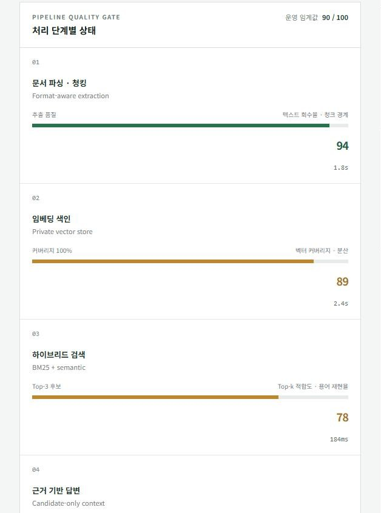
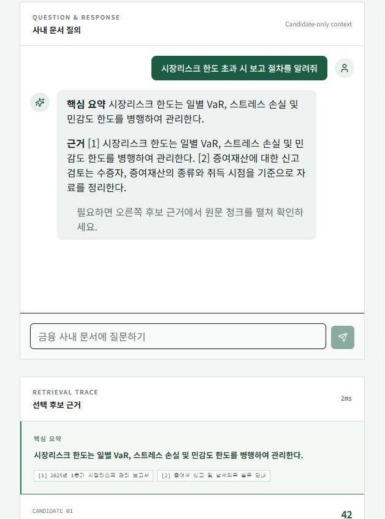
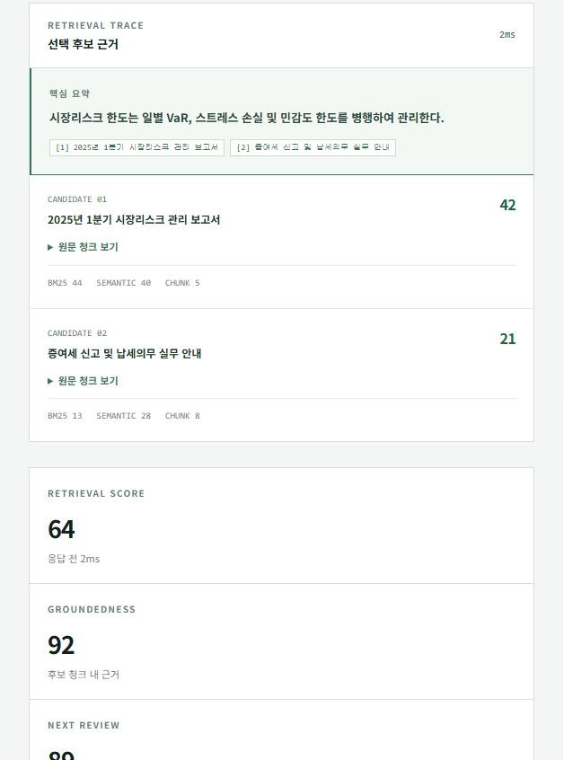
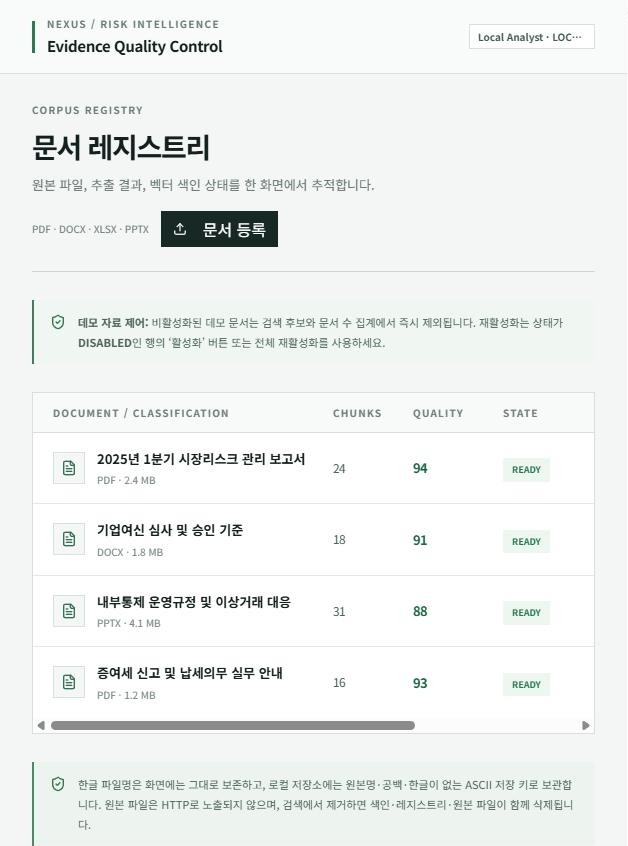
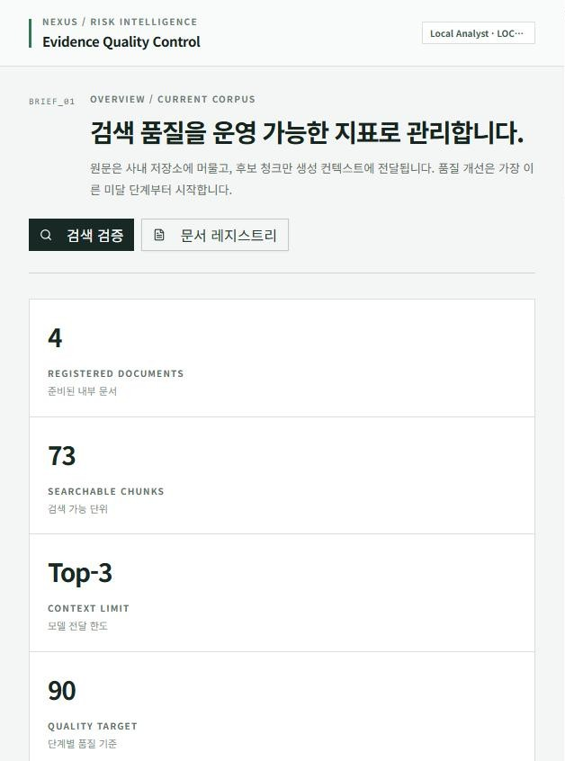
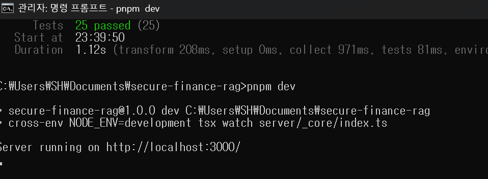
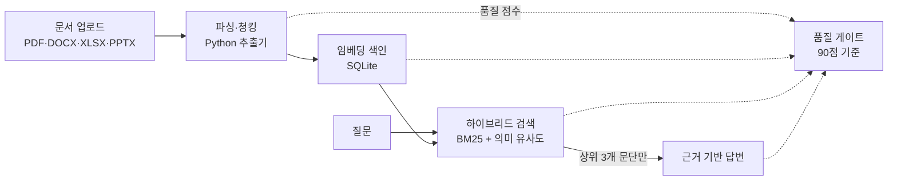

# Secure Finance RAG

금융회사 사내 문서를 대상으로 한 RAG 파이프라인입니다. 시장리스크 보고서, 여신 심사 기준, 내부통제 규정 같은 문서를 올리면 내용을 쪼개 색인하고, 질문이 들어오면 관련 문단을 찾아 근거를 붙여 답합니다.

일반적인 RAG 데모와 다른 점은 두 가지입니다.

첫째, 데이터가 밖으로 나가지 않습니다. 금융 문서는 고객 정보와 내부 판단이 섞여 있어서 외부 AI API에 보내는 순간 문제가 됩니다. 그래서 파싱부터 검색, 답변까지 전부 실행 중인 PC 안에서 처리하고, 답변 단계에도 검색으로 고른 문단 세 개만 넘깁니다.

둘째, 답이 틀렸을 때 어디를 고쳐야 하는지 보여줍니다. RAG는 문서 추출, 임베딩, 검색, 답변이 줄줄이 이어져 있어서 결과만 봐서는 원인을 알기 어렵습니다. 이 프로젝트는 단계마다 품질 점수를 매기고, 기준(90점)에 못 미치는 단계 중 가장 앞에 있는 것부터 고치라고 알려줍니다.

## 화면

<table>
  <tr>
    <td width="33%"></td>
    <td width="33%"></td>
    <td width="33%"></td>
  </tr>
  <tr>
    <td>단계별 품질 게이트. 파싱 94, 임베딩 89, 검색 78, 답변 96점. 검색 점수가 가장 낮지만 그보다 앞에 있는 임베딩이 먼저 기준에 미달하므로 임베딩부터 개선 대상으로 잡습니다.</td>
    <td>질문하면 핵심 요약과 함께 어느 문서의 몇 번째 근거에서 나온 말인지 번호로 표시합니다. 후보로 고른 문단 밖의 내용은 답변에 쓰지 않습니다.</td>
    <td>답변에 쓰인 후보 문단마다 키워드 점수(BM25)와 의미 유사도 점수를 따로 보여줘서, 왜 이 문단이 뽑혔는지 확인할 수 있습니다.</td>
  </tr>
  <tr>
    <td width="33%"></td>
    <td width="33%"></td>
    <td width="33%"></td>
  </tr>
  <tr>
    <td>문서 레지스트리. PDF, DOCX, XLSX, PPTX를 올리면 청크 수와 추출 품질이 바로 표시됩니다. 데모 문서는 검색 대상에서 켜고 끌 수 있습니다.</td>
    <td>운영 개요. 등록 문서 수, 검색 가능한 청크 수, 답변에 넘기는 문단 수 한도, 품질 기준을 한 번에 봅니다.</td>
    <td>Windows 11에서 테스트 25개를 통과하고 로컬 서버를 띄운 모습입니다.</td>
  </tr>
</table>

## 어떻게 동작하나



1. 파싱·청킹: 문서 형식별로 텍스트를 뽑고 문장 경계를 기준으로 겹치게 자릅니다. 텍스트가 얼마나 회수됐는지, 청크 경계가 자연스러운지로 점수를 냅니다.
2. 임베딩 색인: 각 청크를 벡터로 바꿔 저장합니다. 지금은 외부 모델 없이 돌아가도록 결정론적 64차원 임베딩을 쓰고, 커버리지와 분산으로 품질을 봅니다.
3. 하이브리드 검색: "VaR", "한도 초과"처럼 정확한 용어가 중요한 금융 문서 특성상 키워드 검색(BM25)과 의미 검색을 섞어 점수를 매깁니다.
4. 근거 기반 답변: 검색된 상위 3개 문단 안에서만 문장을 골라 답하고, 근거가 부족하면 부족하다고 표시합니다.

점수 기준과 단계별 운영 전환 방향은 [ARCHITECTURE.md](ARCHITECTURE.md)에 자세히 적었습니다.

## 보안과 성능 사이의 선택

금융 데이터로 AI를 쓸 때 현실적인 선택지는 세 가지라고 봤습니다. 대시보드에도 이 비교를 그대로 넣어 두었습니다.

| 경로 | 데이터가 머무는 곳 | 보안 | 성능 | 맞는 상황 |
|---|---|---|---|---|
| 승인된 사내 AI | 사내망, 승인된 모델 | 80 | 85 | 일상적인 운영 답변 |
| 로컬 모델 | PC 또는 폐쇄망 | 100 | 60 | 최고 기밀 분석 |
| 마스킹 샘플 | 원본은 사내, 샘플만 외부로 | 92 | — | 외부 환경에서 개발·포맷 검증 |

세 번째 경로를 위해 `scripts/local_masker.py`를 만들었습니다. 계좌번호, 주민번호, 카드번호, 연락처 같은 값을 같은 값이면 같은 토큰이 나오도록 치환해서, 데이터 구조와 관계는 살리고 실제 값은 지웁니다. 사용법은 [LOCAL_MASKING_GUIDE.md](LOCAL_MASKING_GUIDE.md)에 있습니다.

## 실행

Node.js 22 이상, pnpm, Python 3가 필요합니다. PDF를 올리려면 `pdftotext`(poppler)도 PATH에 있어야 합니다. DOCX·XLSX·PPTX는 Python만 있으면 됩니다.

```bash
corepack enable        # pnpm 활성화 (Windows는 관리자 권한 터미널에서)
git clone https://github.com/hyeonn31/secure-finance-rag.git
cd secure-finance-rag
pnpm install
pnpm dev
```

브라우저에서 http://localhost:3000 을 열면 됩니다. 별도 설정 없이 바로 동작하고, 처음 실행할 때 `data/` 폴더에 DB 파일(`rag.db`)과 업로드 저장소가 만들어집니다.

Windows에서는 Python이 `python` 명령으로 실행되는 것을 기본으로 합니다. `py`로만 실행된다면 `.env`에 `PYTHON=py`를 넣어 주세요. poppler는 `winget install oschwartz10612.Poppler` 같은 방법으로 설치할 수 있습니다.

배포용 빌드는 `pnpm build && pnpm start`, 테스트는 `pnpm test`, 타입 검사는 `pnpm check`입니다. 설정을 바꾸고 싶으면 `.env.example`을 `.env`로 복사해서 고치면 됩니다.

Docker로 띄울 때는 포트를 반드시 루프백에만 열어 주세요.

```bash
docker build -t secure-finance-rag .
docker run -p 127.0.0.1:3000:3000 -v rag-data:/app/data secure-finance-rag
```

## 로컬 모드의 보안 경계

로그인이 없습니다. 대신 아래 조건으로 "이 PC의 사용자만 쓸 수 있다"를 보장합니다.

- 서버는 기본적으로 `127.0.0.1`에만 바인딩되어 같은 네트워크의 다른 기기에서 접속할 수 없습니다.
- Host 헤더가 localhost 계열이 아니면 요청을 거절합니다. 로그인 없는 로컬 서버를 악성 웹페이지가 DNS 리바인딩으로 호출하는 공격을 막기 위한 장치입니다.
- 업로드한 원본 파일은 `data/uploads` 아래에 한글이나 원래 파일명이 들어가지 않은 ASCII 키로 저장되고, HTTP로는 내려받을 수 없습니다. 문서를 삭제하면 색인과 원본 파일이 함께 지워집니다.
- 외부로 나가는 요청이 없습니다. 답변 생성도 검색된 후보 청크 안에서만 문장을 고르는 방식이라 LLM API를 호출하지 않습니다.

`data/` 폴더를 BitLocker나 FileVault로 암호화된 디스크에 두면 저장 데이터 보호까지 OS 수준에서 해결됩니다.

## 구조

```
server/
  routers.ts              tRPC API (대시보드, 검색, 업로드, 삭제)
  rag/                    파싱·청킹·임베딩·하이브리드 검색·품질 점수
  repo/
    documentRepository.ts 저장소 인터페이스
    sqliteRepository.ts   SQLite 구현 (현재 유일한 구현)
  storage.ts              로컬 디스크 저장소
  _core/hostGuard.ts      Host 헤더 검사
client/                   React 대시보드
scripts/                  로컬 마스킹 변환기, 문서 파서 (Python)
drizzle/schema.ts         테이블 정의
```

라우터는 `DocumentRepository` 인터페이스만 알고 있습니다. 지금은 클론하자마자 돌아가도록 SQLite 구현 하나만 두었고, 여러 사람이 쓰는 사내 서버로 옮길 때는 PostgreSQL(pgvector) 구현을 추가해서 갈아끼우는 것을 전제로 설계했습니다.

## 사내망 서버로 옮길 때

로컬 모드는 한 사람이 자기 PC에서 쓰는 것을 전제로 합니다. 사내 서버에 올려 여러 명이 쓰려면 최소한 다음이 필요합니다.

1. 사내 SSO 연동으로 사용자 식별 (`server/_core/context.ts`에서 고정 사용자를 실제 인증으로 교체)
2. `HOST`와 `ALLOWED_HOSTS`를 사내 도메인에 맞게 설정
3. 문서 소유자별 접근 제어와 감사 로그
4. 저장소를 PostgreSQL과 사내 객체 저장소로 교체
5. 결정론적 임베딩과 문장 추출식 답변을 사내 임베딩 모델과 사내 LLM으로 교체
